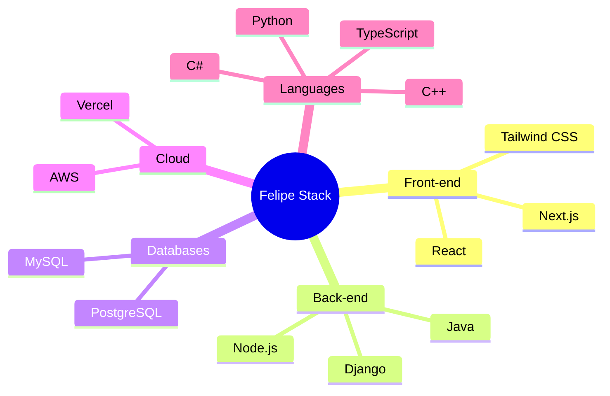

<div align="center">
  
# [](https://git.io/typing-svg)

[](https://visitorbadge.io/status?path=https%3A%2F%2Fgithub.com%2FFehFernandes)
[](https://github.com/FehFernandes)
[](https://www.linkedin.com/in/felipe-fernandessa/)

</div>

<p align="center">
  
</p>

## 🚀 Visão Geral


```typescript
const felipe = {
    nome: "Felipe Fernandes",
    localização: "Brasil 🇧🇷",
    formação: "Bacharel em Sistemas de Informação - IFMG",
    cargo: "Desenvolvedor Full Stack",
    foco: "Desenvolvimento Web, Dados e IA",
    objetivos2025: [
        "Contribuir para projetos open source",
        "Especialização em Arquitetura Cloud",
        "Desenvolvimento de soluções com IA"
    ],
    interesses: [
        "Tecnologia", "Inovação", 
        "Machine Learning", "Cloud Computing"
    ]
};
```

## 📊 Estatísticas GitHub

<div align="center">
   
  
</div>

## 💻 Stack Tecnológico

### Linguagens & Frameworks


### Tecnologias & Ferramentas

<details>
<summary>🔨 Desenvolvimento</summary>
<br>

&nbsp;
&nbsp;
&nbsp;
&nbsp;

</details>

<details>
<summary>📱 Mobile & Front-end</summary>
<br>

&nbsp;
&nbsp;
&nbsp;
&nbsp;

</details>

<details>
<summary>⚙️ Back-end & Dados</summary>
<br>

&nbsp;
&nbsp;
&nbsp;
&nbsp;
&nbsp;

</details>

## 📈 Atividade

<div align="center">
  
[](https://github.com/vn7n24fzkq/github-profile-summary-cards)
[](https://github.com/vn7n24fzkq/github-profile-summary-cards)

</div>

## 🌐 Conecte-se Comigo

<div align="center">

[](https://www.linkedin.com/in/felipe-fernandessa/)
[](mailto:contatofelipef7@gmail.com)
[](https://github.com/FehFernandes)

</div>

---

<div align="center">
  
  
  <p>🌟 Se algum dos meus projetos te ajudou, ficarei feliz em receber uma ⭐️!</p>
</div>
