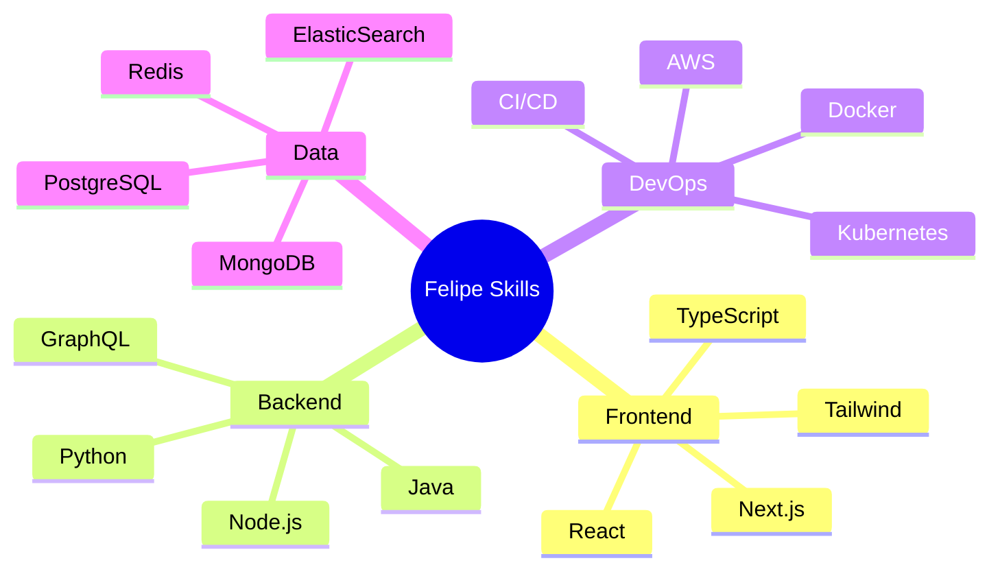

<div align="center">
  
# [](https://git.io/typing-svg)

<!-- Status Banner -->
<p align="center">
  <a href="https://github.com/FehFernandes">
    
  </a>
</p>

<!-- Profile Metrics -->
<p align="center">
  
  <a href="https://github.com/FehFernandes?tab=followers">
    
  </a>
  <a href="https://www.linkedin.com/in/felipe-fernandessa/">
    
  </a>
  
</p>
</div>

<br>

## 👨‍💻 Sobre Mim

```javascript
const Felipe = {
    profile: {
        name: "Felipe Fernandes",
        location: "Brasil 🇧🇷",
        role: "Desenvolvedor Full Stack",
        education: "Bacharel em Sistemas de Informação - IFMG"
    },
    
    skills: {
        languages: ["JavaScript", "TypeScript", "Python", "Java"],
        frontend: ["React", "Next.js", "Tailwind CSS", "Styled Components"],
        backend: ["Node.js", "Django", "Spring Boot", "Express"],
        database: ["PostgreSQL", "MongoDB", "Redis", "ElasticSearch"],
        devops: ["AWS", "Docker", "Kubernetes", "CI/CD"],
        tools: ["Git", "VS Code", "Postman", "Figma"]
    },
    
    currentChallenge: "Desenvolvendo soluções inovadoras com IA 🤖",
    goals2025: [
        "Contribuir em projetos open source 🌟",
        "Especialização em Arquitetura Cloud ☁️",
        "Desenvolvimento de produtos escaláveis 📈"
    ]
};
```

<br>

## 📊 GitHub Stats
<div align="center">
<div>
  
  
  <div style="display: inline_block">
    
    
  </div>

  
</div>
</div>

<br>

## 🚀 Tech Stack

<div align="center">

<!-- Dynamic Skill Tree -->


### Frontend


### Backend


### Database & Cloud


</div>

<br>

## 🛠️ Projetos que estou fazendo 🧑‍🏭
<div align="center">
<div>
  <a href="https://github.com/FehFernandes/ReprodutordevideoXAML">
    
  </a>
</div>
</div>

<br>

## 📅 Metas 2025
<div align="center">
  
| Meta | Status |
|------|--------|
| 📚 Publicar artigos técnicos | Em progresso |
| 🤖 Aprender mais sobre IA | Planejando |
| 🌟 Contribuir para projetos Open Source | Em progresso |
| 📜 Certificações Cloud | Planejando |

</div>

<br>

## 📫 Contato
<div align="center">
<div>
  <a href="mailto:contatofelipef7@gmail.com">
    
  </a>
  <a href="https://www.linkedin.com/in/felipe-fernandessa/">
    
  </a>
  <a href="https://discord.com/users/felpsz2_">
    
  </a>
</div>
</div>

<details>
<summary>🎯 Fun Facts</summary>
<br>

- 🎮 Favorite Game: Skyrim
- 📚 Currently Reading: Clean Architecture
- ☕ Coffee Consumption: 4 cups/day
- 🎵 Coding Playlist: Synthwave & Lo-fi
- 🌍 Dream Setup: Fully Automated Home Office
- 🎯 Next Learning Goal: Quantum Computing

</details>

<div align="center">

  
### Feito com 💜 por Felipe Fernandes
  
⭐️ Se algum projeto ajudou você, considere deixar uma estrela!

</div>

<div align="center">
<sub>Last updated: December 2024</sub>
</div>
