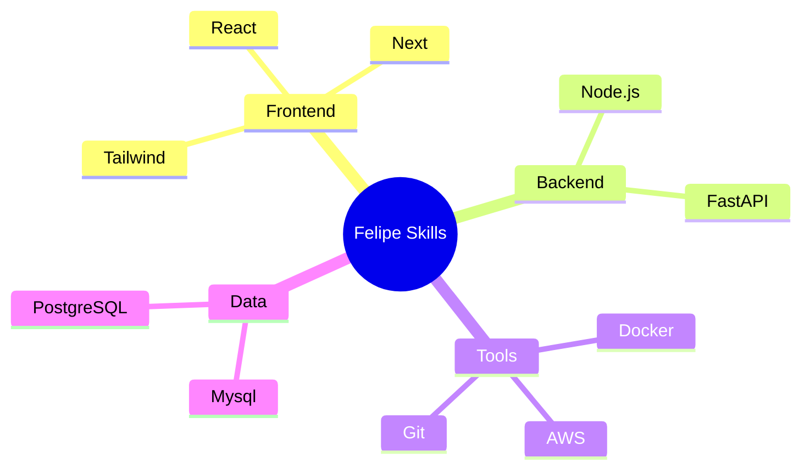

<div align="center">
  
# [](https://git.io/typing-svg)

<!-- Status Banner -->
<p align="center">
  <a href="https://github.com/FehFernandes">
    
  </a>
</p>

<!-- Profile Metrics -->
<p align="center">
  
  <a href="https://github.com/FehFernandes?tab=followers">
    
  </a>
  <a href="https://www.linkedin.com/in/felipe-fernandessa/">
    
  </a>
  
</p>
</div>

<br>

## 👨‍💻 Sobre Mim

```javascript
const Felipe = {
    profile: {
        name: "Felipe Fernandes",
        location: "Brasil 🇧🇷",
        role: "Desenvolvedor Full Stack",
        education: "Bacharel em Sistemas de Informação - IFMG",
        languages: [
            "Português",
            "Inglês (Intermediário)",
            "Espanhol (Intermediário)"
        ],
    },
    goals2025: [
        "Contribuir para projetos Open Source",
        "Aprender mais sobre IA",
        "Publicar artigos",
        "Certificações Cloud"
    ],
};
```

<br>

## 📊 GitHub Stats
<div align="center">
<div>
  
  
  <div style="display: inline_block">
    
    
  </div>

  
</div>
</div>

<br>

## 🚀 Tech Stack

<div align="center">

<!-- Dynamic Skill Tree -->


## Conhecimentos 


#### Frontend


#### Backend


#### Ferramentas 


#### Banco de dados


#### Design & Outros


### Experiências


</div>

<br>

## 🛠️ Projetos sendo feitos atualmente 🧑‍🏭
<div align="center">
<div>
  <a href="[https://github.com/FehFernandes/APIweather](https://github.com/FehFernandes/APIweather)">
    
  </a>
</div>
</div>

<br>

## 📅 Metas 2025
<div align="center">
  
| Meta | Status |
|------|--------|
| 📚 Publicar artigos | Planejando |
| 🤖 Aprender mais sobre IA | Planejando |
| 🌟 Contribuir para projetos Open Source | Planejando |
| 📜 Certificações Cloud | Planejando |

</div>

<br>

## 📫 Contato
<div align="center">
<div>
  <a href="mailto:contatofelipef7@gmail.com">
    
  </a>
  <a href="https://www.linkedin.com/in/felipe-fernandessa/">
    
  </a>
  <a href="https://discord.com/users/felpsz2_">
    
  </a>
</div>
</div>

<details>
<summary>🎯 Fun Facts</summary>
<br>

- 🎮 Favorite Game: Skyrim
- 🌍 Dream Setup: Fully Automated Home Office
- 🎵 Coding Playlist: Synthwave & Lo-fi
- ☕ Coffee Consumption: 4 cups/day
- 📚 Currently Reading: Clean Architecture
- 🎯 Next Learning Goal: Quantum Computing

</details>

<div align="center">

  
### Feito com 💜 por Felipe Fernandes
  
⭐️ Se algum projeto ajudou você, considere deixar uma estrela!

</div>

<div align="center">
<sub>Last updated: December 2024</sub>
</div>
